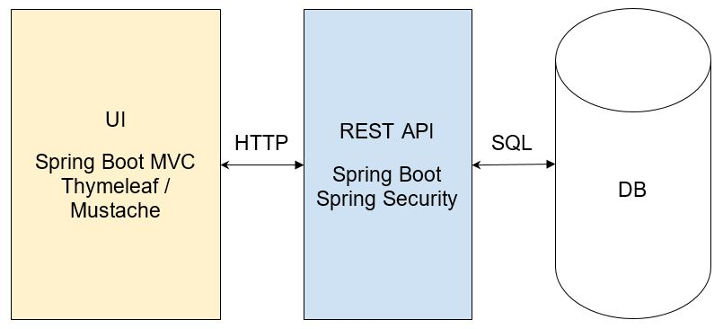

### Project type: web application (2 services + DB)

### Data flow:

Requirements: 
●	Should run on the reviewer’s machine 
●	Should have test coverage 
●	Should contain a user authentication/authorization mechanism 
●	Should comply with the best practices of Object Oriented Design and the predominant Java code style 

Project ideas: 
●	A marketplace 

Admin credentials to see an application.yml, go to [server-api\src\main\resources\application.yml]()

To see available REST API endpoints, go to [http://localhost:8080/swagger-ui/index.html]() 
To see an application, go to [http://localhost:8081]()

Adding mail, go to [https://support.google.com/accounts/answer/185833?hl=ua]() 
Adding reCAPTCHA to the site, go to [https://www.google.com/recaptcha/admin/site/642490035/setup]()