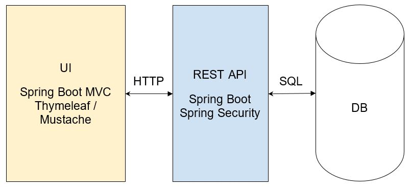

### Project type: web application (2 services + DB)

### Data flow:

Requirements: 
●	Should run on the reviewer’s machine 
●	Should have test coverage 
●	Should contain a user authentication/authorization mechanism 
●	Should comply with the best practices of Object Oriented Design and the predominant Java code style 

Project ideas: 
●	A marketplace for goods 

Admin credentials: 
●	login: sa@gmail.com 
●	password: 1234567890

Admin menu: 
●	/admins

To see available endpoints, go to [http://localhost:8080/swagger-ui.html]()